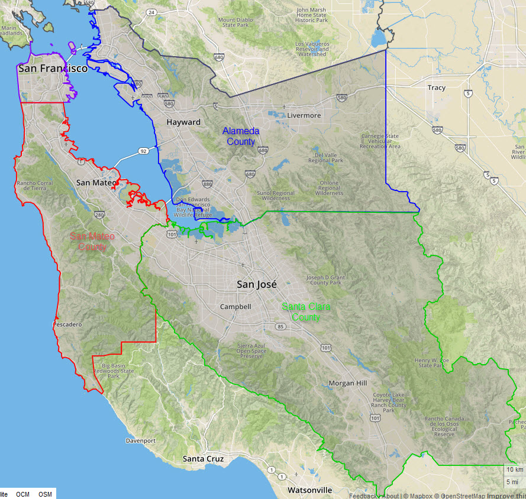
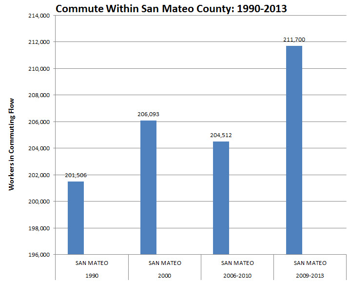
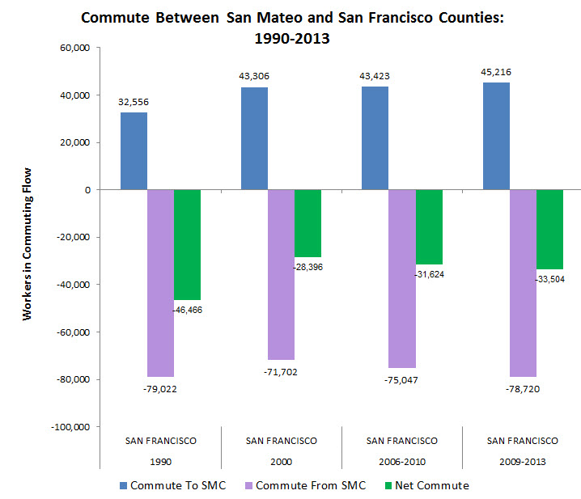
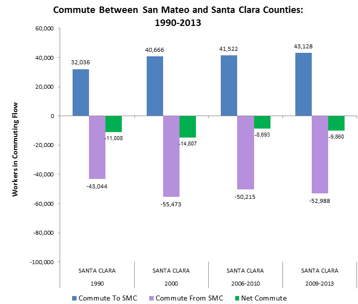
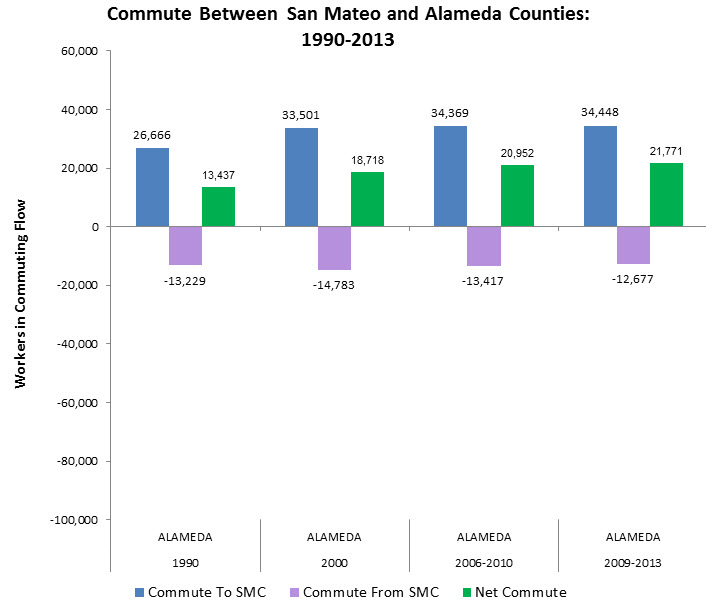

<a href="https://juli2017.github.io/simple-page">Return To Main</a> 
# San Mateo County Traffic Trends  

link: https://juli2017.github.io/SMCTraffic/

“'It’s harder to get around, and it is harder to find transportation access and also access to housing,' ...  

An estimated 54 percent of the respondents believe it is more difficult to get around the Bay Area than it was a year ago, the poll determined. That’s up sharply from the 37 percent who felt that way in 2015 and more than double the 25 percent with that assessment in 2014." **Source: 29 April 2016.** <a href="http://www.mercurynews.com/2016/04/29/bay-area-traffic-ignites-backlash-against-boom-new-poll-suggests/">Bay Area traffic ignites backlash against boom, new poll suggests</a>   

"Caltrain’s rush hour trains have never been more crowded, which isn’t just uncomfortable for riders — it also discourages potential commuters who instead drive along Peninsula highways, and makes rides more difficult for elderly passengers and riders with disabilities." **Source: 3 April 2014.** <a href="http://sf.streetsblog.org/2014/04/03/caltrain-crowding-to-worsen-even-with-longer-trains-in-2015/">Longer Trains May Be No Match for Growing Caltrain Crowds</a>  

"Given the Bay Area’s housing market challenges, BART’s capacity to transport people between geographies with affordable housing and those with growing job markets has been a key to economic health and opportunity for many households." **Source:** <a href="http://www.bayareaeconomy.org/report/the-case-for-a-second-transbay-transit-crossing/consequences-of-transbay-travel-constraints/">Consequences of Transbay Travel Constraints</a>

  

San Mateo County is positioned between San Francisco to the north and Santa Clara County to the south.  Across San Francisco Bay to the east is Alameda County.  The large coastal portion of the County is separated from the inland portion by the Santa Cruz Mountains, which have limited roadways going west to east.  Access between the North and East Bay is limited by the four bridges: the Golden Gate Bridge going north out of San Francisco, the Bay Bridge is the the direct road between San Francisco and Oakland in Alameda County, the San Mateo Bridge (Hwy 92) crossing the San Francisco Bay from San Mateo County to Alameda County, and the Dumbarton Bridge running from Menlo Park (very near the Facebook campus) east to Fremont in Alameda County.

The rapid increase in jobs in the Bay Area has increased ridership on public transit systems to the point where ridership exceeds capacity on BART or CalTrain during peak commute times, making it a less attractive alternative to driving. 

The traffic patterns are greatly impacted by the distance between where a person lives and where they work.  This in turn is affected by regional variation in housing availability and affordabilty, preferences between urban and suburban living, and where the employers with rapidly growing workforces choose to locate their employees.  Proximity to large IT campuses can also impact the quality of life for local residents. The current plans by Facebook in Menlo Park to expand its workforce and campus has inspired a heated debate within the county regarding the sustainability of unconstrained growth in high tech jobs when it is perceived as coming at the expense of other residents in the county.

  

Commute traffic for people who live and work in San Mateo County has increased significantly in the past two years, increasing by over 7,000 workers between 2010 and 2013.  

  

The number of commuters between San Mateo County and San Francisco County has been relatively stable over the past ten years, and shows a net commute of over 30,000 more people commuting to than from San Francisco County.  

  

The number of commuters between San Mateo County and Santa Clara County has also been relatively stable over the past ten years, and the net commute of about 10,000 more people commuting to than from San Santa Clara County is much smaller than that for San Francisco County.  
 
   

The number of commuters between San Mateo County and Alamdea County is the only one that shows more workers commuting in than out.  This may reflect the difference in housing costs between the two counties, where Alameda County was considered a more affordable place to live relative to San Mateo County.  Traffic congestion on the two bridges connecting Alameda and San Mateo counties has increased significantly in the past ten years (see News Articles Below).

* Source: American Community Survey Residence County to Workplace County Commuting Flows for the United States and Puerto Rico Sorted by Residence Geography

* Data Source: <a href="https://docs.google.com/spreadsheets/d/1dPI98w727Wwli4jj8yftZsu-LlRzzKLf5VOmeRKCO8w/edit#gid=842113511">County to County Commute Data Source</a>

# News Articles
## 2013 
* 17 January 2013: <a href="http://www.bart.gov/news/articles/2013/news20130117">Train strain: BART working on capacity issues as ridership rises to record levels</a>  

## 2015
* 7 July 2015: <a href="http://kalw.org/post/what-facebooks-expansion-means-east-palo-alto">What Facebook's expansion means for East Palo Alto</a>  
* 24 November 2015: <a href="http://www.sfgate.com/bayarea/article/Bay-Area-commute-analysis-Awful-ride-6647859.php">Bay Area commute’s ‘awful’ ride now stretches to before 5 a.m.</a>  
* 21 December 2015: <a href="https://ww2.kqed.org/news/2015/12/21/facebooks-10-mile-10000-solution-to-workers-commute-problem/">Facebook’s 10-Mile, $10,000 Solution to Workers’ Long Commutes</a>  

## 2016  
* 3 June 2016: <a href="http://www.bizjournals.com/sanfrancisco/blog/2016/06/caltrain-hits-new-ridership-record-for-sixth-year.html">Caltrain hits new ridership record for sixth year in a row</a>
* 13 June 2016: <a href="http://sf.streetsblog.org/2016/06/13/why-are-more-facebook-workers-driving-to-the-office/">Why are More Facebook Workers Driving to the Office?</a>  
* 6 July 2016: <a href="https://www.paloaltoonline.com/square/2016/07/06/study-warns-facebook-expansion-would-affect-traffic">Facebook expansion traffic impacts</a>  
* 3 October 2016: <a href="http://www.mercurynews.com/2016/10/03/bay-areas-10-worst-commutes-unveiled-no-3-is-a-surprise/">Bay Area’s 10 most congested freeways (No. 3 is a surprise)  </a>  

## 2018  
* 27 April 2018: <a href="https://www.sfgate.com/traffic/article/Bay-Area-commute-San-Francisco-traffic-12861808.php">Stunning increase in Bay Area 'super commuters' in the last decade amid housing crisis</a>

